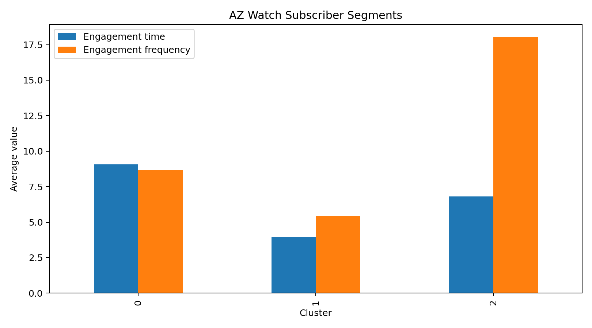

# AZ Watch Subscriber Churn & Segmentation

Machine learning project analyzing subscriber behavior for AZ Watch, an educational video-streaming platform.

## Objectives

- Predict subscriber churn with classification models.
- Compare Logistic Regression, Decision Tree, and Random Forest.
- Segment subscribers with K-Means clustering.
- Identify engagement patterns that can support marketing and retention strategies.

## Results

| Model | Test Accuracy |
|---|---:|
| Logistic Regression | 92.5% |
| Decision Tree | 92.0% |
| Random Forest | 91.5% |

### Subscriber segmentation

K-Means clustering was applied to standardized engagement time and engagement frequency. Three behavioral segments were selected for the final analysis.



## Project structure

```text
AZWatch_Subscriber_Churn/
├── AZWatch_Subscriber_Churn.ipynb
├── data/
│   └── AZWatch_subscribers.csv
├── marketinganalytics.jpg
├── cluster_engagement_profile.png
├── requirements.txt
├── .gitignore
└── README.md
```

## How to run

1. Clone the repository.
2. Install the dependencies:

```bash
pip install -r requirements.txt
```

3. Open `AZWatch_Subscriber_Churn.ipynb` in Jupyter Notebook, JupyterLab, or VS Code.
4. Run the cells from top to bottom.

## Notes

The notebook uses one-hot encoding for the categorical `age_group` feature and standardization before K-Means clustering.
